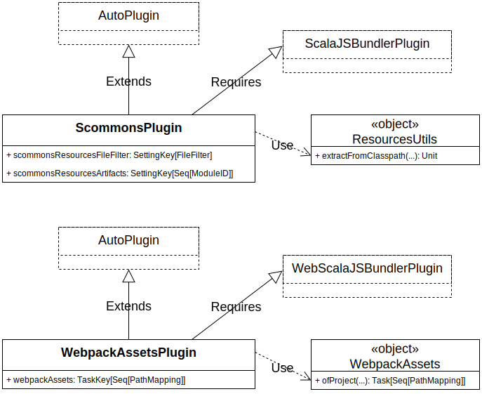

Welcome to the **Scala Commons Sbt Plugin** documentation page!

## Overview


[Preview](https://www.draw.io/?chrome=0&lightbox=1&url=https%3A%2F%2Fraw.githubusercontent.com%2Fscommons%2Fsbt-scommons-plugin%2Fmaster%2Fdocs%2Fdrawio%2Foverview.svg%3Ft%3D0) | [Edit](https://www.draw.io/?title=overview.svg&url=https%3A%2F%2Fraw.githubusercontent.com%2Fscommons%2Fsbt-scommons-plugin%2Fmaster%2Fdocs%2Fdrawio%2Foverview.svg%3Ft%3D0)

## ScommonsPlugin

The main purpose of this sbt `auto-plugin` is to copy/extract resource files
(`css`, `png`, `jpeg`) from project dependencies to the `webpack` folder
during the `fastOptJS/fullOptJS` `scalajs` task, so they can be used later
by the `webpack` task.

This is very similar to copying/extracting of `*.js` files,
which is already provided by the `ScalaJSBundlerPlugin`.

Since this plugin is sbt `auto-plugin`, it will be automatically activated
for all the projects that depend on `ScalaJSBundlerPlugin`.

It provides the following settings:
```scala
val scommonsResourcesFileFilter: SettingKey[FileFilter] = settingKey[FileFilter](
  "File filter of resources files, that should be automatically copied/extracted to the webpack directory"
)
val scommonsResourcesArtifacts: SettingKey[Seq[ModuleID]] = settingKey[Seq[ModuleID]](
  "List of artifacts (JARs) with resources, that should be automatically extracted to the webpack directory"
)

val scommonsBundlesFileFilter: SettingKey[FileFilter] = settingKey[FileFilter](
  "File filter of bundles files, that should be automatically generated in the webpack directory"
)
```

With default values:
```scala
scommonsResourcesFileFilter :=
  "*.js" ||
    "*.json" ||
    "*.css" ||
    "*.ico" ||
    "*.png" ||
    "*.jpg" ||
    "*.jpeg" ||
    "*.gif" ||
    "*.svg" ||
    "*.ttf" ||
    "*.mp3" ||
    "*.wav" ||
    "*.mp4" ||
    "*.mov" ||
    "*.html" ||
    "*.pdf"

scommonsResourcesArtifacts := Seq(
  "org.scommons.react" % "scommons-react-core" % "*",
  "org.scommons.client" % "scommons-client-ui" % "*"
)

scommonsBundlesFileFilter := NothingFilter
```

You can extend/override the default values:
```scala
settings(
    scommonsResourcesFileFilter :=
        scommonsResourcesFileFilter.value || "*.svg",

    scommonsResourcesArtifacts ++= Seq(
      "your.org" % "your-dependency" % "*"
    ),
    
    // will generate bundle.json file(s) with migrations for SQLite
    // see `scommons-websql-migrations` module
    scommonsBundlesFileFilter := "*.sql"
)
```

## WebpackAssetsPlugin

The main purpose of this sbt `auto-plugin` is to make the assets (`css`),
produced by the `webpack` task, available as `sbt-web` assets.

This is very similar to the `npmAssets` task, which is already provided
by the `WebScalaJSBundlerPlugin`.

Since this plugin is sbt `auto-plugin`, it will be automatically activated
for all the projects that depend on `WebScalaJSBundlerPlugin`.

It provides the following task:
```scala
val webpackAssets: TaskKey[Seq[PathMapping]] = taskKey[Seq[PathMapping]](
  "Assets (resources that are not CommonJS modules) produced by Webpack"
)
```

It depends on the `webpack` task which in turn depends on `scalajs` task.
Thus this task should be scoped by a `scalajs` task (`fastOptJS` or `fullOptJS`).

To use it for particular client project, add the following to your web-project (server) settings:
```scala
settings(
    webpackAssets in fastOptJS ++= WebpackAssets.ofProject(fastOptJS, clientProject) { build => (build / "styles").*** }.value,
    webpackAssets in fullOptJS ++= WebpackAssets.ofProject(fullOptJS, clientProject) { build => (build / "styles").*** }.value
)
```
(here, `clientProject` is your client sbt `Project` definition.)

Or for all specified `scalaJSProjects`:
```scala
settings(
    webpackAssets in fastOptJS ++= WebpackAssets.ofScalaJSProjects(fastOptJS) { build => (build / "styles").*** }.value,
    webpackAssets in fullOptJS ++= WebpackAssets.ofScalaJSProjects(fullOptJS) { build => (build / "styles").*** }.value
)
```

